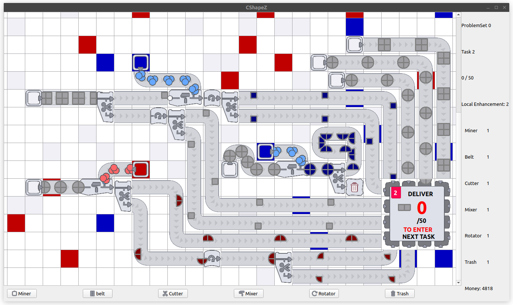

# CShapeZ

CShapeZ 是一个工业流水线模拟器，参照原版 [ShapeZ](https://github.com/tobspr-games/shapez.io) 完成了 NJU 高级程序设计 课程大作业。

## 项目展示

## 操作说明

### 编辑地图

<kbd>H</kbd>, <kbd>J</kbd>, <kbd>K</kbd>, <kbd>L</kbd>: 上下左右移动;

<kbd>Space</kbd>: 按下开始选择，释放完成选择并放置当前设备;

<kbd>1</kbd> ~ <kbd>6</kbd>: 选择下一个设备;

<kbd>R</kbd>: 调整下一个放置的设备的朝向;

### 地图移动缩放

<kbd>C</kbd>: 地图平移到中心;

<kbd>Ctrl</kbd><kbd>+</kbd>, <kbd>Ctrl</kbd><kbd>-</kbd>: 放大/缩小地图;

<kbd>Ctrl</kbd><kbd>0</kbd>: 重置缩放;

### 局部强化

<kbd>+</kbd>: 消耗一次局部强化机会，强化当前设备效率;

### 全局强化

<kbd>S</kbd>: 显示商店;

## 致谢

本项目使用了 [ShapeZ](https://github.com/tobspr-games/shapez.io) 的素材、音乐等，版权归原作者所有。
